# 🌟 Cloud File Navigator Pro 🚀

[](https://www.python.org/)
[](https://fastapi.tiangolo.com/)
[](https://aws.amazon.com/s3/)
[](https://tailwindcss.com/)
[](LICENSE)

## 🎯 Project Overview

Welcome to **Cloud File Navigator Pro**, a web-based file management application for **AWS S3** built with **Python**, **FastAPI**, and **Tailwind CSS**. This project offers a user-friendly, JavaScript-free interface to manage S3 buckets and files, supporting advanced features like bulk operations, file tagging, temporary file sharing, and a bucket usage dashboard. It’s designed for accessibility and simplicity, making it ideal for individual and enterprise users managing cloud storage. ☁️

## 📑 Table of Contents

- [✨ Features](#-features)
- [📂 Project Structure](#-project-structure)
- [🛠 Prerequisites](#-prerequisites)
- [🚀 Setup Instructions](#-setup-instructions)
- [📡 Usage](#-usage)
- [🏗 Architecture](#-architecture)
- [🧪 Testing](#-testing)
- [🧹 Cleanup](#-cleanup)
- [🔧 Troubleshooting](#-troubleshooting)
- [🤝 Contributing](#-contributing)
- [📜 License](#-license)
- [📞 Contact](#-contact)

## ✨ Features

- **Bucket Management**: Create, list, and delete S3 buckets 📦.
- **File/Folder Operations**: Upload, download, delete, rename, copy, and move files/folders 📁.
- **Bulk Operations**: Copy, move, or delete multiple files/folders at once ⚡.
- **Advanced Search**: Filter files by name, size, date, content type, or custom tags 🔍.
- **File Sharing**: Generate temporary, pre-signed URLs for secure file sharing 🔗.
- **Bucket Usage Dashboard**: Visualize bucket statistics (size, file/folder count, last modified) with a CSS-based bar chart 📊.
- **File Tagging**: Add and filter files by custom tags for organization 🏷️.
- **File Preview**: Inline previews for images, text, and PDFs 🖼️.
- **Breadcrumbs Navigation**: Easily navigate folder hierarchies 🗺️.
- **JavaScript-Free**: Built with Tailwind CSS for accessibility and simplicity 🎨.

## 📂 Project Structure

```
cloud-file-navigator-pro/
├── main.py                     # 🧠 FastAPI application
├── templates/                  # 📄 HTML templates for UI
│   ├── index.html             # 🏠 Homepage (bucket list)
│   ├── bucket.html            # 📦 Bucket file management
│   ├── preview.html           # 🖼️ File preview
│   ├── metadata.html          # 🏷️ File metadata and tagging
│   ├── search.html            # 🔍 Advanced search
│   ├── success.html           # ✅ Success messages
│   ├── confirm_delete.html    # 🗑️ Delete confirmation
│   ├── uploading.html         # ⬆️ Upload progress
│   ├── dashboard.html         # 📊 Bucket usage dashboard
├── static/                    # 🎨 Tailwind CSS and static assets
├── requirements.txt           # 📋 Python dependencies
└── README.md                  # 📖 Project documentation
```

## 🛠 Prerequisites

- 🐍 **Python 3.12+**
- ☁️ **AWS Account** with S3 access
- 🔧 **AWS CLI** configured with credentials
- 🌐 **Browser** for accessing the web interface

Verify setup:
```bash
python --version
aws --version
```

## 🚀 Setup Instructions

### 1. Clone the Repository
```bash
git clone https://github.com/Basavarajsm2102/cloud-file-navigator-pro.git
cd cloud-file-navigator-pro
```

### 2. Create a Virtual Environment
```bash
python -m venv .venv
source .venv/bin/activate  # On Windows: .venv\Scripts\activate
```

### 3. Install Dependencies
```bash
pip install -r requirements.txt
```

### 4. Configure AWS Credentials
Ensure AWS credentials are set up with the required IAM permissions:
```bash
aws configure
```
**Required IAM Permissions**:
```json
{
    "Effect": "Allow",
    "Action": [
        "s3:GetObject",
        "s3:PutObject",
        "s3:DeleteObject",
        "s3:ListBucket",
        "s3:PutObjectTagging",
        "s3:GetObjectTagging"
    ],
    "Resource": ["arn:aws:s3:::*"]
}
```

### 5. Start the Application
Run the FastAPI server:
```bash
uvicorn main:app --reload
```
Access the application at `http://localhost:8000`.

## 📡 Usage

1. **Homepage**:
   - View existing S3 buckets or create a new one (e.g., `test-bucket-123`).
   - Click “View Dashboard” for bucket statistics.
2. **Bucket Management**:
   - Navigate to a bucket to upload files, create folders, or manage content.
   - Use the search bar to filter by name, size, date, or tags.
3. **File Actions**:
   - **Preview**: View images, text, or PDFs inline.
   - **Share**: Generate pre-signed URLs with expiration times.
   - **Tag**: Add custom tags (e.g., `projectX`) via the metadata page.
   - **Bulk Operations**: Select multiple files/folders for copy, move, or delete.
4. **Dashboard**:
   - View bucket sizes, file/folder counts, and last modified dates.
   - Explore the CSS-based bar chart for size comparisons.

**Example Request** (via browser or `curl`):
```bash
curl http://localhost:8000/
```
This displays the homepage with your S3 buckets.

## 🏗 Architecture

The diagram below details the Cloud File Navigator Pro workflow:

```mermaid
graph TD
    subgraph "Frontend"
        A[User Browser 🌐<br>Tailwind CSS UI] -->|HTTP Requests| B[FastAPI Server 🧠<br>Routes & Endpoints]
        A -->|Render| C[Templates<br>index.html, bucket.html 🎨]
    end
    subgraph "Backend"
        B -->|S3 Operations| D[AWS S3 SDK<br>boto3 📦]
        D -->|List, Get, Put| E[AWS S3<br>Buckets & Files ☁️]
    end
    subgraph "Core Features"
        B -->|Manage Buckets| F[Bucket Operations<br>Create, List, Delete 📦]
        B -->|Manage Files| G[File Operations<br>Upload, Download, Move 📁]
        B -->|Bulk Actions| H[Bulk Operations<br>Copy, Move, Delete ⚡]
        B -->|Search| I[Advanced Search<br>Name, Size, Tags 🔍]
        B -->|Share| J[Pre-signed URLs<br>Temporary Sharing 🔗]
        B -->|Tag| K[File Tagging<br>Custom Metadata 🏷️]
        B -->|Visualize| L[Bucket Dashboard<br>CSS Bar Chart 📊]
        B -->|Preview| M[File Preview<br>Images, Text, PDFs 🖼️]
    end
    subgraph "Storage"
        E -->|Store Data| N[S3 Buckets<br>Files & Metadata 💾]
    end
```




## 🧪 Testing

1. **Create a Bucket**:
   - On the homepage, create a bucket (e.g., `test-bucket-123`).
2. **Upload a File**:
   - Navigate to the bucket, upload `image.jpg`, and verify it appears.
3. **Share a File**:
   - Click “Share”, select an expiration time, and test the pre-signed URL.
4. **Add Tags**:
   - Go to a file’s metadata, add a tag (e.g., `projectX`), and search using it.
5. **View Dashboard**:
   - Check the dashboard for bucket stats and the CSS bar chart.
6. **Bulk Operations**:
   - Select multiple files, copy/move to another bucket, or delete.

## 🧹 Cleanup

To stop the application:
```bash
Ctrl+C  # Stop the uvicorn server
deactivate  # Exit the virtual environment
```
To delete test buckets:
- Use the application’s UI or AWS CLI:
  ```bash
  aws s3 rb s3://test-bucket-123 --force
  ```

## 🔧 Troubleshooting

- **AWS Credentials Error**:
  - Verify `aws configure` settings and IAM permissions.
  - Check logs: `uvicorn` output in the terminal.
- **S3 Access Denied**:
  - Ensure the IAM policy includes required actions (`s3:GetObject`, etc.).
  - Confirm the AWS region matches your S3 buckets.
- **FastAPI Not Starting**:
  - Ensure port `8000` is free: `lsof -i :8000` (Linux) or `netstat -an` (Windows).
  - Check dependencies: `pip install -r requirements.txt`.
- **UI Rendering Issues**:
  - Verify Tailwind CSS is compiled in `static/`.
  - Clear browser cache or test in incognito mode.
- **Pre-signed URL Not Working**:
  - Check the expiration time and ensure the file exists in S3.

For more help:
- [FastAPI Docs](https://fastapi.tiangolo.com/)
- [AWS S3 Docs](https://docs.aws.amazon.com/s3/)
- [Tailwind CSS Docs](https://tailwindcss.com/docs)

## 🤝 Contributing

Contributions are welcome! 🙌
1. Fork the repository.
2. Create a branch: `git checkout -b feature-name`.
3. Commit changes: `git commit -m "Add feature"`.
4. Push: `git push origin feature-name`.
5. Open a pull request on GitHub.

**Suggestions**:
- Add screenshots of the UI (e.g., dashboard, file preview) to a `screenshots/` folder.
- Example: ``.

## 📜 License

This project is licensed under the MIT License. See [LICENSE](LICENSE) for details.

## 📞 Contact

For support or feature requests, contact [basavarajsm2102@gmail.com](mailto:basavarajsm2102@gmail.com) or open an issue on GitHub.

---

*Built with ❤️ for seamless AWS S3 file management using FastAPI and Tailwind CSS! ☁️📁*
